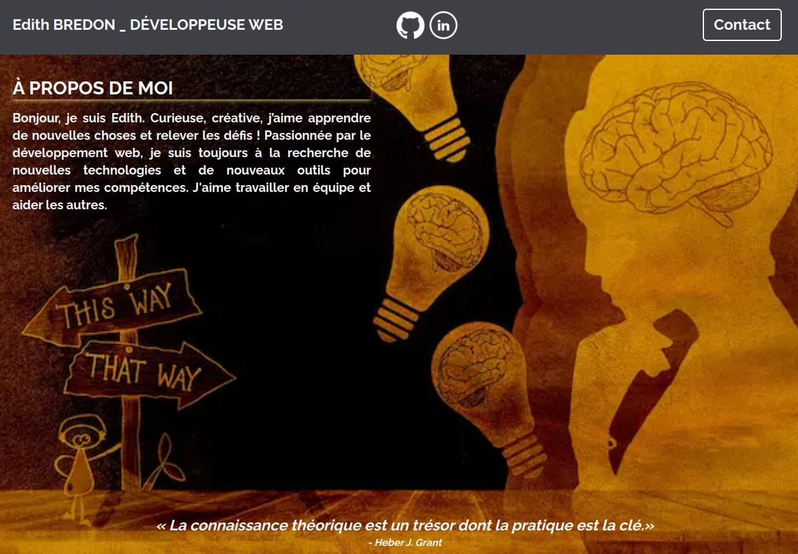

# Portfolio Edith Bredon



Ce portfolio a été créé avec Next.js et déployé sur Vercel. Il utilise une API pour afficher mes projets (https://backoffice.edithbredon.fr).

## Technologies utilisées

- [NextJS](https://nextjs.org/)
- [React](https://reactjs.org/)
- [TypeScript](https://www.typescriptlang.org/)
- [Jest and React Testing Library](https://nextjs.org/docs/testing#jest-and-react-testing-library)
- [Tailwind CSS](https://tailwindcss.com/)
- [Vercel](https://www.vercel.com/) (pour le déploiement)

## Fonctionnalités

- Affichage des projets
- Filtrage des projets par mots-clés
- Affichage des détails du projet
- Affichage des projets similaires
- Formulaire de contact
- Tests avec Jest

## Installation

1. Clonez le dépôt: `git clone https://github.com/edithbdev/portfolio-front.git`
2. Installez les dépendances: `npm install`

## Utilisation

1. Démarrez l'application: `npm run dev`
2. Ouvrez votre navigateur et allez sur `http://localhost:3000`

## Tests
```bash
npm run test
```

## Couverture de code
```bash
npm run coverage
```

## Déploiement

Le déploiement est automatique sur Vercel à chaque push sur la branche `main`.

## Auteur

Edith Bredon - [edithbredon.fr](https://www.edithbredon.fr/)